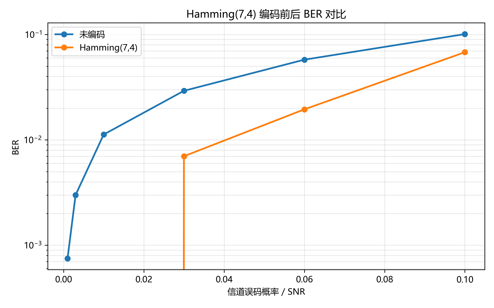
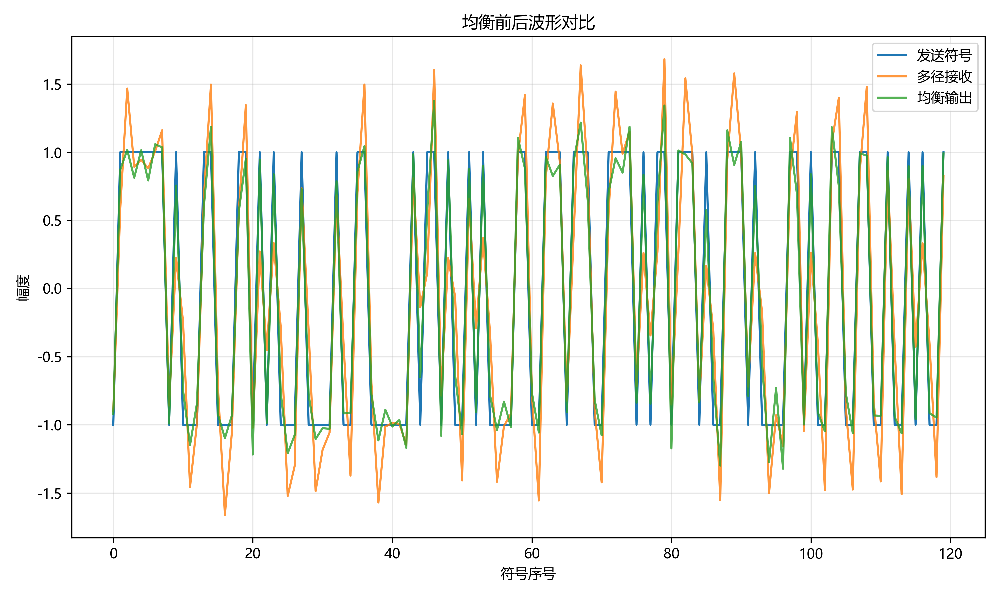
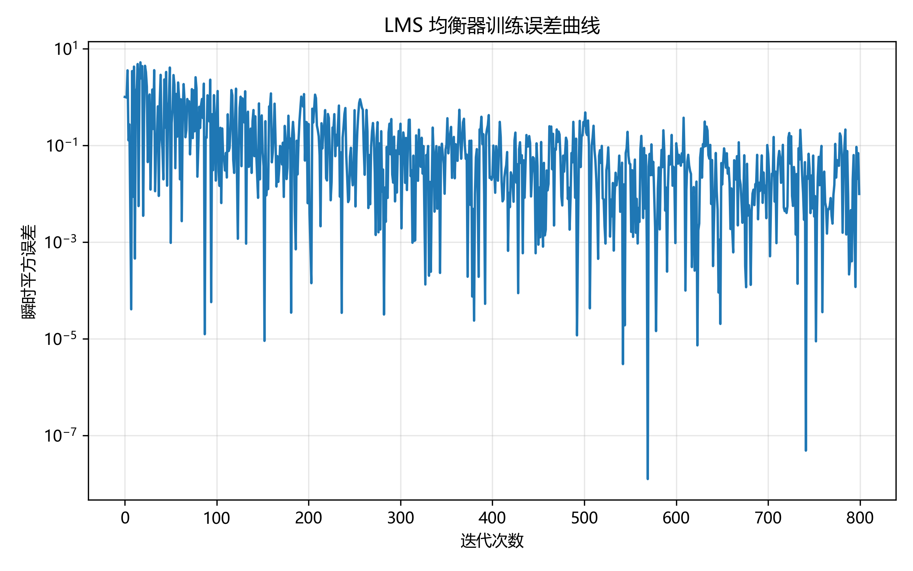

# 无线通信技术实验报告：信道编码与信道均衡

## 1. 实验目的

本次实验主要围绕无线通信中的信道编码和信道均衡两个问题展开。通过补全 Python 代码和运行仿真实验，我希望掌握 Hamming(7,4) 线性分组码的基本编码、伴随式检测和单比特纠错过程，理解信道编码为什么能提高传输可靠性。同时，通过多径信道、ZF 均衡和 LMS 自适应均衡的仿真，观察符号间干扰（ISI）对接收信号的影响，以及均衡器对失真信号的补偿效果。

此外，本实验也要求使用自动评分脚本检查函数正确性、结果图生成情况和实验报告完整性，因此我也练习了用 pytest 和评分脚本对代码进行验证，而不是只看程序能否运行。

## 2. 实验原理

### 2.1 信道编码

信道编码的基本思想是在原始信息比特中加入一定的冗余，使接收端能够根据这些冗余发现甚至纠正传输错误。本实验采用 Hamming(7,4) 码，即每 4 个信息比特生成 7 个编码比特，其中多出的 3 个比特用于校验。它是一种系统码，编码后的前 4 位保留原始信息位，后 3 位为校验位。

编码时使用生成矩阵 `G`，把每组 4 位信息比特看成行向量，与 `G` 在 GF(2) 上相乘并对 2 取模，得到 7 位码字。接收端使用校验矩阵 `H` 计算伴随式：

```text
s = r H^T mod 2
```

如果接收码字没有错误，则伴随式为全 0；如果发生单比特错误，伴随式会等于校验矩阵 `H` 中对应错误位置的列向量。因此只要把非零伴随式与 `H` 的每一列比较，就可以定位错误比特并翻转该位。Hamming(7,4) 的最小码距为 3，所以它可以纠正 1 位错误，也可以检测 2 位错误。

选做部分实现了 (2,1,3) 卷积码编码和 Viterbi 硬判决译码。卷积码不是按固定分组独立编码，而是让当前输出与当前输入和前面的若干输入状态有关。本实验采用生成多项式 `g1=111`、`g2=101`，每输入 1 位输出 2 位，并在末尾添加两个 0 使状态回到全零。Viterbi 译码通过比较不同路径的汉明距离，选择累计距离最小的路径作为估计输入序列。

### 2.2 信道均衡

无线信道中可能存在多径传播，同一个符号经过不同路径到达接收端，会产生延迟叠加，导致符号间干扰（ISI）。本实验用一个 FIR 多径信道模拟这种情况，接收信号可以看成发送符号与信道冲激响应卷积后的结果，再叠加一定噪声。

ZF（Zero-Forcing）均衡的目标是设计一个 FIR 均衡器，使信道和均衡器的联合响应尽量接近单位冲激响应，从而消除 ISI。在代码中通过构造卷积矩阵 `A`，求解 `A @ taps ≈ d` 的最小二乘解来得到均衡器抽头。但 ZF 只强调消除信道失真，如果某些频率处信道响应很弱，它可能会把噪声也一起放大。

LMS 自适应均衡是一种基于训练序列的迭代算法。它用当前抽头向量和接收输入向量计算输出，再用期望发送符号与实际输出的差值更新抽头：

```text
y[n] = w^T x[n]
e[n] = d[n] - y[n]
w = w + μ e[n] x[n]
```

其中 `μ` 是步长。步长过大时容易振荡甚至发散，步长过小时收敛速度较慢。

## 3. 实验环境

- 操作系统：Windows
- Python 版本：Python 3.13.5
- 主要依赖：NumPy 2.1.3、Matplotlib 3.10.0、pytest 8.3.4
- 运行解释器：`D:\Anaconda\python.exe`
- AI 助手使用情况：使用 AI 辅助阅读模板、补全代码思路、排查 Windows 终端输出编码问题，并运行测试验证结果。核心算法已结合实验原理和测试结果进行检查。

## 4. 实验方法与步骤

### 4.1 Part 1：信道编码

首先在 `src/part1_channel_coding.py` 中实现 Hamming(7,4) 编码函数。输入比特先转换成一维 NumPy 数组，并检查长度是否为 4 的倍数，然后 reshape 成 `(-1, 4)` 的分组矩阵，与 `HAMMING_G` 相乘后对 2 取模，最后重新展开成一维编码序列。

接着实现伴随式计算函数。对于输入的一维码字序列，先按 7 位一组 reshape；对于二维输入，则直接检查每行是否为 7 位。然后计算 `codewords @ HAMMING_H.T % 2`，得到每个码字对应的 3 位伴随式。

译码函数中，先复制接收码字，避免直接修改原始输入。对每个码字计算伴随式，如果伴随式非零，就与校验矩阵每一列比较。匹配到对应列后，翻转该位置的比特，完成单比特纠错。最后取每个码字的前 4 位作为恢复出的信息比特。

完成函数后运行 `src/part1_channel_coding.py`，程序生成随机比特，分别比较未编码传输和 Hamming 编码传输在二元对称信道下的 BER，并保存 BER 曲线图。

### 4.2 Part 2：信道均衡

在 `src/part2_equalization.py` 中，首先实现 ZF 均衡器估计。根据给定信道响应和均衡器抽头数，构造卷积矩阵，使每一列对应一个延迟后的信道响应。目标向量在中心位置设为 1，其余位置为 0，然后用 `np.linalg.lstsq` 求最小二乘解。

FIR 滤波函数比较直接，使用 `np.convolve(signal, taps, mode='full')` 得到完整卷积结果，再截取与输入信号等长的前半部分，保持后续 BER 判断的序列长度一致。

LMS 均衡器中，将抽头初始化为中心抽头为 1，其余为 0。接收训练序列前面补零，然后每次取一个长度为 `num_taps` 的输入向量，计算输出、误差和抽头更新。训练结束后返回最终抽头和每次迭代的误差序列。运行 Part 2 脚本后，程序生成均衡前后波形对比图和 LMS 误差曲线。

## 5. 实验结果

运行 Part 1 后得到 Hamming(7,4) 编码前后的 BER 曲线：



根据本次运行数据，二元对称信道错误概率从 0.001 增加到 0.1 时，未编码 BER 大致从 0.0008 增加到 0.1010；使用 Hamming(7,4) 后，在低错误概率时 BER 明显降低，例如错误概率为 0.01 时译码后 BER 为 0。在错误概率较高时，编码后 BER 仍低于未编码，但改善程度会变小。

运行 Part 2 后得到均衡前后信号对比图：



本次均衡仿真中，程序输出的均衡前 BER 为 0.0010，LMS 均衡后 BER 为 0.0000。虽然这次信道和噪声条件下原始 BER 已经不高，但从波形上仍能看到均衡输出比多径接收信号更接近原始 BPSK 符号。

LMS 训练误差曲线如下：



误差曲线整体呈下降趋势，说明 LMS 抽头通过训练逐渐适应了当前多径信道。由于训练序列和噪声存在随机性，曲线中仍会有波动，这属于自适应算法中的正常现象。

## 6. 结果分析与讨论

1. Hamming(7,4) 为什么能纠正单比特错误？

Hamming(7,4) 的校验矩阵每一列都不相同。当某一位发生错误时，伴随式正好等于该错误位置对应的校验矩阵列向量。因此接收端可以根据伴随式定位错误位，再将该位翻转回来。由于它的最小码距为 3，所以能够可靠纠正 1 位错误。

2. 为什么信道编码会引入冗余并降低码率？

信道编码需要增加校验信息，接收端才能判断传输是否出错。Hamming(7,4) 每 4 位信息要发送 7 位码字，码率为 `4/7`，低于未编码时的码率 1。这说明可靠性提高是以传输冗余和有效信息速率下降为代价的。

3. ZF 均衡为什么可能放大噪声？

ZF 均衡试图把信道响应完全抵消。如果信道在某些频率处衰落很深，均衡器就需要很大的增益来补偿这些频率分量。这样虽然可以减小 ISI，但接收噪声也会被同样放大，所以在低信噪比或深衰落条件下，ZF 不一定是最优选择。

4. LMS 的步长过大或过小会出现什么问题？

步长过大时，每次抽头更新幅度太大，误差可能来回振荡，严重时会发散。步长过小时，算法比较稳定，但收敛速度慢，需要更多训练样本才能达到较好的均衡效果。因此实际使用中要在收敛速度和稳定性之间折中选择步长。

5. 均衡前后 ISI 有什么变化？

均衡前，接收信号是发送符号经过多径信道卷积后的结果，相邻符号之间会互相影响，波形幅度不再稳定地落在 BPSK 的理想电平附近。均衡后，LMS 抽头对信道失真进行了补偿，输出序列更接近原始符号，ISI 得到抑制，BER 也有所改善。

## 7. 实验心得

这次实验让我把课上比较抽象的编码和均衡公式落实到了代码里。Hamming 码部分最关键的是理解伴随式和校验矩阵列之间的对应关系，代码其实不长，但如果矩阵方向或 reshape 写错，就会导致译码结果完全不对。均衡部分让我更直观地理解了多径信道造成的 ISI，也看到了 LMS 这种迭代算法如何通过误差不断修正抽头。

调试时我也体会到自动测试的重要性。单独运行 demo 只能说明程序大概能跑，而 pytest 会检查已知编码结果、单比特纠错、ZF 抽头长度、ISI 抑制效果和 LMS 误差下降等细节。最后还遇到了 Windows 控制台对 emoji 输出编码不兼容的问题，这提醒我实验代码除了算法正确，也要注意运行环境的兼容性。

总体来说，本实验帮助我理解了通信系统中“增加冗余提高可靠性”和“用均衡补偿信道失真”这两类常见思路。后续如果继续扩展，可以进一步比较不同信噪比下的编码增益，或者尝试 MMSE 均衡与 ZF 均衡的性能差异。

## 8. 参考资料

- 课程课件：第 6 章 信道编码
- 课程课件：第 7 章 均衡
- 项目 README 与实验模板 `REPORT_TEMPLATE.md`
- NumPy、Matplotlib 和 pytest 官方文档
